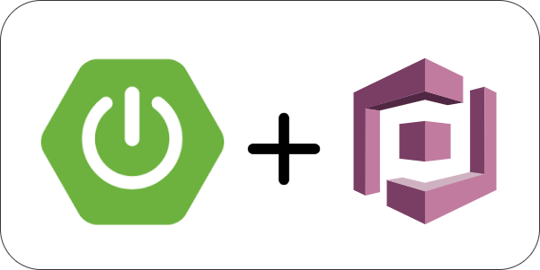

## _Employee Resource Server integrated with Cognito_

**_Features_**:

      1. Oauth2 JWT token validation suing JWK.
      2. Authorization using Cognito user pools.
      3. Employee resource server.      
      
Please, check out the [Angular Employee Dashboard App](https://github.com/sangeethapradeep/amplify-employee-angular-app)     

**_Credits:_** 

A work inspired from - ["Integrate Spring Boot Resource Server with Cognito Identity Provider."](https://medium.com/@arjunsk/resource-server-with-cognito-b7fbfbee0155)

    

     
